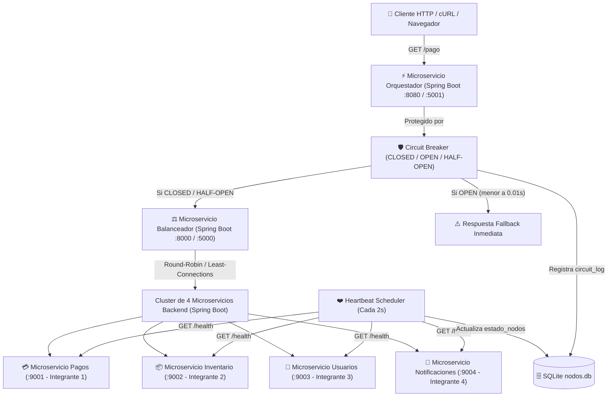

# Guía de Actividades Práctico-Experimentales (APE 15 y 16)
## Arquitectura de Microservicios Distribuidos en Java (Spring Boot): Balanceador de Carga con Heartbeat Failover, Patrón Circuit Breaker y Persistencia en SQLite (`nodos.db`)

Este repositorio contiene la solución integral para las prácticas **APE Nro. 15 y 16** de la asignatura de **Sistemas Distribuidos**. El proyecto implementa una arquitectura distribuida modular en **Java Spring Boot 3 / Java 21** que combina monitorización física en segundo plano (**Heartbeat Failover**), protección lógica de red (**Patrón Circuit Breaker**) y auditoría persistente en una base de datos local **SQLite (`nodos.db`)**.

---

## 📐 Arquitectura de Microservicios Spring Boot



---

## 🧩 Microservicios del Proyecto (1 por Integrante + Infraestructura)

1. **`microservicio-orquestador` (Spring Boot - Puerto 8080 / 5001)**:
   - Actúa como API Gateway / Cliente principal.
   - Implementa el patrón **Circuit Breaker** (clase `CircuitBreaker.java`) con estados `CLOSED`, `OPEN`, `HALF_OPEN`.
   - Persiste cada cambio de estado del circuito en la tabla `circuit_log` de SQLite (`nodos.db`).

2. **`microservicio-balanceador` (Spring Boot - Puerto 8000 / 5000)**:
   - Microservicio Proxy que distribuye el tráfico entre las 4 instancias backend activas.
   - Contiene el `HeartbeatScheduler` que sondea `/health` en los nodos cada 2s (timeout 1.5s).
   - Persiste el estado físico de los nodos (`ACTIVO` / `INACTIVO`) en la tabla `estado_nodos` de SQLite (`nodos.db`).

3. **`microservicio-pagos` (Spring Boot - Puerto 9001 - Integrante 1)**:
   - Microservicio Backend de Procesamiento de Pagos.
   - Expone `/health` y `/api/pagos/procesar`.

4. **`microservicio-inventario` (Spring Boot - Puerto 9002 - Integrante 2)**:
   - Microservicio Backend de Gestión de Inventario.
   - Expone `/health` y `/api/inventario/consultar`.

5. **`microservicio-usuarios` (Spring Boot - Puerto 9003 - Integrante 3)**:
   - Microservicio Backend de Autenticación y Usuarios.
   - Expone `/health` y `/api/usuarios/verificar`.

6. **`microservicio-notificaciones` (Spring Boot - Puerto 9004 - Integrante 4)**:
   - Microservicio Backend de Envíos y Notificaciones.
   - Expone `/health` y `/api/notificaciones/enviar`.

---

## 🌐 Despliegue en un Cluster Multimáquina (Red LAN / Switch Ethernet)

Para realizar la presentación en el laboratorio utilizando múltiples computadores físicos o máquinas virtuales conectados a un Switch Ethernet:

1. **En las PCs de los Integrantes 1, 2, 3 y 4 (Nodos Backend)**:
   - Integrante 1 (PC 1 - `192.168.1.30`): `cd microservicio-pagos && mvn spring-boot:run`
   - Integrante 2 (PC 2 - `192.168.1.31`): `cd microservicio-inventario && mvn spring-boot:run`
   - Integrante 3 (PC 3 - `192.168.1.32`): `cd microservicio-usuarios && mvn spring-boot:run`
   - Integrante 4 (PC 4 - `192.168.1.33`): `cd microservicio-notificaciones && mvn spring-boot:run`

2. **En la PC del Balanceador de Carga (PC 5 - `192.168.1.20`)**:
   - Inicia el microservicio balanceador:
     ```bash
     cd microservicio-balanceador && mvn spring-boot:run
     ```

3. **En la PC del Orquestador (PC 6 - `192.168.1.10`)**:
   - Inicia el microservicio orquestador vinculando la IP del balanceador:
     ```bash
     BALANCER_URL="http://192.168.1.20:8000" cd microservicio-orquestador && mvn spring-boot:run
     ```

---

## 🗄️ Modelo de Datos SQLite (`nodos.db`)

### 1. Tabla `estado_nodos` (Heartbeat Físico - Guía 15)
```sql
CREATE TABLE IF NOT EXISTS estado_nodos (
    id INTEGER PRIMARY KEY AUTOINCREMENT,
    nodo TEXT NOT NULL UNIQUE,          -- Ejemplo: "127.0.0.1:9001"
    puerto INTEGER NOT NULL,            -- Ejemplo: 9001
    estado TEXT NOT NULL,               -- "ACTIVO" o "INACTIVO"
    latencia REAL DEFAULT 0.0,          -- Latencia en ms
    ultima_actualizacion TEXT NOT NULL  -- Formato YYYY-MM-DD HH:MM:SS
);
```

### 2. Tabla `circuit_log` (Auditoría Lógica de Red - Guía 16)
```sql
CREATE TABLE IF NOT EXISTS circuit_log (
    id INTEGER PRIMARY KEY AUTOINCREMENT,
    servicio TEXT NOT NULL,             -- Ejemplo: "ServicioOrquestador"
    estado_anterior TEXT NOT NULL,      -- "CLOSED", "OPEN", "HALF_OPEN"
    nuevo_estado TEXT NOT NULL,         -- "CLOSED", "OPEN", "HALF_OPEN"
    motivo TEXT,                        -- Razón de la transición
    timestamp TEXT NOT NULL             -- Formato YYYY-MM-DD HH:MM:SS
);
```

---

## 📊 Tabla de Observaciones (Resultados Esperados Guía 16)

| Escenario | Estado de Backends | Estado BD: `estado_nodos` | Estado del Circuito (Esperado) | Tiempo de respuesta Orquestador | Registro BD: `circuit_log` |
| --- | --- | --- | --- | --- | --- |
| **Backends activos** | 9001-9004: ACTIVO | 9001: ACTIVO, 9002: ACTIVO... | **`CLOSED`** | ~0.05s | `CLOSED` |
| **Caen ambos/todos Backends** | Todos inactivos | 9001: INACTIVO, 9002: INACTIVO... | **`CLOSED` -> Acumula 3 fallos** | ~1s | - |
| **Backends siguen caídos** | Todos inactivos | 9001: INACTIVO, 9002: INACTIVO... | **`OPEN`** | **< 0.01s** (Fallback) | `OPEN` |
| **Pasan 10s (Prueba Half-Open)** | Todos inactivos | 9001: INACTIVO, 9002: INACTIVO... | **`HALF_OPEN` -> `OPEN`** | ~1s | `HALF_OPEN`, `OPEN` |
| **Backends recuperados + 10s** | Todos activos | 9001: ACTIVO, 9002: ACTIVO... | **`HALF_OPEN` -> `CLOSED`** | ~0.05s | `HALF_OPEN`, `CLOSED` |

---

## ❓ Preguntas de Control Resueltas (Guía 16)

1. **En esta arquitectura integrada, si un solo backend (ej. el puerto 9001) cae pero los otros siguen activos, ¿el Circuit Breaker del Orquestador debería abrirse? Justifica tu respuesta.**
   - **Respuesta**: **No, el Circuit Breaker NO debe abrirse**. Debido a que el Balanceador de Carga realiza failover automático a nivel de proxy, al caer el microservicio de pagos (9001), el balanceador detecta la falla por Heartbeat y desvía las peticiones a los microservicios restantes. El Orquestador continúa recibiendo respuestas HTTP 200 exitosas, por lo que el Circuit Breaker se mantiene en estado **`CLOSED`**. El circuito solo se abrirá cuando **todos los nodos del pool caen simultáneamente** o el propio Balanceador deja de responder.

2. **¿Qué diferencia hay entre el mecanismo de Heartbeat (práctica 15) y el Circuit Breaker (práctica 16) en cuanto a la detección de fallos?**
   - **Respuesta**: 
     - **Heartbeat (Monitoreo Activo Proactivo)**: Funciona en segundo plano mediante un hilo periódico que envía pings (`GET /health`) a los nodos a intervalos regulares (sondeo constante). Su objetivo es mantener actualizado el estado físico del cluster independientemente de si hay usuarios enviando peticiones.
     - **Circuit Breaker (Monitoreo Pasivo Reactivo)**: Opera en la línea de tráfico en tiempo real sobre las solicitudes de los usuarios. Su objetivo es cortar la comunicación de red cuando detecta fallos consecutivos de negocio para evitar fallos en cascada y entregar respuestas de Fallback en `< 0.01s`.

3. **Si revisamos la base de datos SQLite justo en el momento que el circuito se abre, ¿habrá diferencia temporal (en segundos) entre el timestamp de `estado_nodos` y el de `circuit_log`? ¿Por qué?**
   - **Respuesta**: **Sí, habrá una pequeña diferencia temporal**. `circuit_log` registra la transición al instante exacto en que la petición del usuario alcanza el umbral de fallos (tiempo real de tráfico). En cambio, `estado_nodos` actualiza su timestamp cuando el hilo de Heartbeat ejecuta su siguiente ciclo de sondeo (cada 2s).

4. **¿En qué escenario de la vida real (ej. Netflix) es crítico tener un Fallback (respuesta alternativa) en lugar de solo devolver un error 500 al usuario cuando el Circuit Breaker se abre?**
   - **Respuesta**: En la pantalla de inicio de Netflix. Si el microservicio distribuido de recomendaciones personalizadas o historial de visualización se cae o sufre timeouts, en lugar de mostrar un error HTTP 500 al usuario, el Circuit Breaker se abre y devuelve un **Fallback** con una lista estática de películas populares o tendencias globales. El usuario puede seguir navegando y reproduciendo contenido sin notar la falla del microservicio de recomendaciones.

5. **Si el balanceador de carga muere repentinamente (se cae el proceso del puerto 8000/5000), ¿cómo reaccionará el Circuit Breaker del Orquestador? ¿Podrá el sistema recuperarse automáticamente alguna vez?**
   - **Respuesta**: El Orquestador acumulará 3 fallos de conexión hacia el balanceador y el Circuit Breaker pasará de inmediato a **`OPEN`**, entregando respuestas de Fallback en `< 0.01s`. **Sí se recuperará automáticamente**: una vez que el proceso del balanceador vuelva a iniciarse, al transcurrir el tiempo de enfriamiento (10s), el Circuit Breaker pasará a **`HALF_OPEN`**, enviará una petición de prueba que resultará exitosa y retornará autónomamente a estado **`CLOSED`**.
