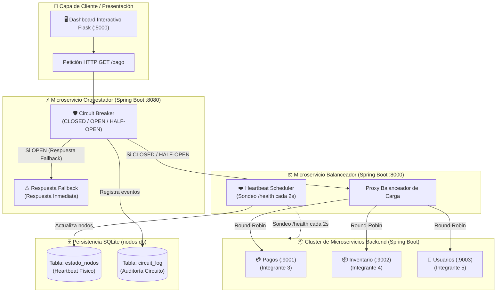

# Guía de Actividades Práctico-Experimentales (APE 15 y 16)
## Arquitectura de Microservicios Distribuidos en Java (Spring Boot) & Dashboard Interactivo en Flask: Balanceador de Carga con Heartbeat Failover, Patrón Circuit Breaker y Persistencia en SQLite (`nodos.db`)

Este proyecto contiene la implementación integral para las prácticas **APE Nro. 15 y 16** de **Sistemas Distribuidos**. El sistema está construido con una arquitectura de **5 Microservicios independientes en Java Spring Boot (Java 21)** y un **Dashboard Web en Flask** para pruebas e inspección en tiempo real.

---

## 📐 Diagrama de Arquitectura del Sistema



---

## 👥 Asignación Oficial de Roles e Integrantes (5 Integrantes)

Cada integrante del equipo es dueño y responsable de ejecutar **1 microservicio Spring Boot**:

| Integrante | Rol en la Práctica | Carpeta del Proyecto | Puerto | Comando de Ejecución |
| --- | --- | --- | --- | --- |
| **Integrante 1** | **Orquestación & Circuit Breaker** | `microservicio-orquestador/` | **`8080`** | `cd microservicio-orquestador && mvn spring-boot:run` |
| **Integrante 2** | **Balanceo de Carga & Heartbeat** | `microservicio-balanceador/` | **`8000`** | `cd microservicio-balanceador && mvn spring-boot:run` |
| **Integrante 3** | **Microservicio Backend: Pagos** | `microservicio-pagos/` | **`9001`** | `cd microservicio-pagos && mvn spring-boot:run` |
| **Integrante 4** | **Microservicio Backend: Inventario** | `microservicio-inventario/` | **`9002`** | `cd microservicio-inventario && mvn spring-boot:run` |
| **Integrante 5** | **Microservicio Backend: Usuarios** | `microservicio-usuarios/` | **`9003`** | `cd microservicio-usuarios && mvn spring-boot:run` |

---

## 🚀 Guía Paso a Paso para Iniciar todo el Sistema

### Requisitos Previos (En todas las laptops):
- **Java 21** o superior (`java -version`).
- **Apache Maven** (`mvn -version`).
- **Python 3** (únicamente para ejecutar el Dashboard Web `frontend/`).

---

### Paso 1: Iniciar los 3 Microservicios Backend (Integrantes 3, 4 y 5)

Cada integrante del cluster abre su terminal en su propia laptop/carpeta y ejecuta su microservicio:

- **Laptop del Integrante 3 (Backend Pagos - Puerto 9001)**:
  ```bash
  cd microservicio-pagos
  mvn spring-boot:run
  ```
  *Verificación:* Abre `http://localhost:9001/health` en el navegador.

- **Laptop del Integrante 4 (Backend Inventario - Puerto 9002)**:
  ```bash
  cd microservicio-inventario
  mvn spring-boot:run
  ```
  *Verificación:* Abre `http://localhost:9002/health` en el navegador.

- **Laptop del Integrante 5 (Backend Usuarios - Puerto 9003)**:
  ```bash
  cd microservicio-usuarios
  mvn spring-boot:run
  ```
  *Verificación:* Abre `http://localhost:9003/health` en el navegador.

---

### Paso 2: Iniciar el Microservicio Balanceador (Integrante 2)

El **Integrante 2** ejecuta el balanceador, el cual creará automáticamente la base de datos `nodos.db` e iniciará el hilo de **Heartbeat** que monitorea a los 3 backends cada 2 segundos:

- **Laptop del Integrante 2 (Balanceador - Puerto 8000)**:
  ```bash
  cd microservicio-balanceador
  mvn spring-boot:run
  ```
  *Verificación:* Abre `http://localhost:8000/balance/procesar` o `http://localhost:8000/api/db/nodos`.

---

### Paso 3: Iniciar el Microservicio Orquestador (Integrante 1)

El **Integrante 1** ejecuta el Orquestador protegido por el **Circuit Breaker** (estados `CLOSED`, `OPEN`, `HALF_OPEN`):

- **Laptop del Integrante 1 (Orquestador - Puerto 8080)**:
  ```bash
  cd microservicio-orquestador
  mvn spring-boot:run
  ```
  *Verificación:* Abre `http://localhost:8080/pago` o `http://localhost:8080/api/circuit/status`.

---

### Paso 4: Iniciar el Dashboard Web en Flask (Cliente / Presentación)

El **Integrante 1** (o cualquiera de los 5 integrantes desde su laptop) inicia la interfaz gráfica interactiva:

1. **Instalar dependencias de Python (solo la primera vez)**:
   ```bash
   python3 -m venv venv
   source venv/bin/activate
   pip install Flask requests
   ```

2. **Ejecutar el Frontend**:
   ```bash
   python3 frontend/app.py
   ```

3. **Abrir la Interfaz Web**:
   Accede en el navegador a: 👉 **`http://localhost:5000`**

---

## 🌐 Configuración para el Laboratorio con Switch Ethernet (Red LAN Multimáquina)

Cuando conecten las 5 laptops al **Switch Ethernet del laboratorio**:

1. Obtengan la dirección IP asignada a cada laptop (`ip a` en Linux o `ipconfig` en Windows).
2. Supongamos las siguientes IPs de ejemplo:
   - PC Integrante 1 (Orquestador): `192.168.1.10`
   - PC Integrante 2 (Balanceador): `192.168.1.20`
   - PC Integrante 3 (Pagos): `192.168.1.30`
   - PC Integrante 4 (Inventario): `192.168.1.31`
   - PC Integrante 5 (Usuarios): `192.168.1.32`

3. **Ejecutar con IPs de Red**:
   - **Integrante 1 (Orquestador)** indica la IP del Balanceador:
     ```bash
     BALANCER_URL="http://192.168.1.20:8000" cd microservicio-orquestador && mvn spring-boot:run
     ```
   - **Frontend Web (Dashboard)** indica la IP del Orquestador:
     ```bash
     ORCHESTRATOR_URL="http://192.168.1.10:8080" python3 frontend/app.py
     ```

---

## 🗄️ Modelo de Datos SQLite (`nodos.db`) con Datos Reales de Ejemplo

> **¿Quién crea la base de datos y cómo se insertan los datos?**  
> **NO TIENES QUE INGRESAR NADA A MANO.**  
> 1. **Creación Automática del Archivo y Tablas**: La base de datos `nodos.db` y sus 2 tablas (`estado_nodos` y `circuit_log`) **se crean automáticamente** en la raíz del proyecto en cuanto ejecutas los microservicios Spring Boot (`microservicio-balanceador` y `microservicio-orquestador`) mediante sentencias SQL DDL (`CREATE TABLE IF NOT EXISTS`).  
> 2. **Llenado Automático de `estado_nodos`**: El hilo de fondo `HeartbeatScheduler` sondea cada 2 segundos a los backends e inserta/actualiza **automáticamente** la latencia, estado (`ACTIVO`/`INACTIVO`) y hora exacta.  
> 3. **Llenado Automático de `circuit_log`**: Cada vez que ocurre una falla o cambio de estado (`CLOSED` &rarr; `OPEN` &rarr; `HALF_OPEN`), la clase `CircuitBreaker` guarda **automáticamente** el evento y el motivo en SQLite.  
> 
> *Las siguientes tablas son un ejemplo ilustrativo del contenido que la aplicación genera de forma autónoma durante la ejecución:*

### 1. Tabla `estado_nodos` (Heartbeat Físico - Guía 15)
Registra la salud física sondeada en tiempo real cada 2 segundos.

```sql
CREATE TABLE IF NOT EXISTS estado_nodos (
    id INTEGER PRIMARY KEY AUTOINCREMENT,
    nodo TEXT NOT NULL UNIQUE,          -- IP:Puerto del backend
    puerto INTEGER NOT NULL,            -- Puerto TCP
    estado TEXT NOT NULL,               -- "ACTIVO" o "INACTIVO"
    latencia REAL DEFAULT 0.0,          -- Tiempo de respuesta en ms
    ultima_actualizacion TEXT NOT NULL  -- Fecha y hora del último pulso
);
```

#### **Ejemplo Real de Contenido en `estado_nodos`**:
| id | nodo | puerto | estado | latencia | ultima_actualizacion |
|---|---|---|---|---|---|
| 1 | `127.0.0.1:9001` | 9001 | **ACTIVO** | 4.25 | 2026-07-23 08:30:02 |
| 2 | `127.0.0.1:9002` | 9002 | **INACTIVO** | 0.00 | 2026-07-23 08:30:04 |
| 3 | `127.0.0.1:9003` | 9003 | **ACTIVO** | 3.10 | 2026-07-23 08:30:02 |

---

### 2. Tabla `circuit_log` (Auditoría de Red - Guía 16)
Registra cada cambio de estado del Circuit Breaker.

```sql
CREATE TABLE IF NOT EXISTS circuit_log (
    id INTEGER PRIMARY KEY AUTOINCREMENT,
    servicio TEXT NOT NULL,             -- Nombre del servicio ("ServicioOrquestador")
    estado_anterior TEXT NOT NULL,      -- "CLOSED", "OPEN", "HALF_OPEN"
    nuevo_estado TEXT NOT NULL,         -- "CLOSED", "OPEN", "HALF_OPEN"
    motivo TEXT,                        -- Razón detallada del cambio
    timestamp TEXT NOT NULL             -- Fecha y hora del evento
);
```

#### **Ejemplo Real de Contenido en `circuit_log`**:
| id | servicio | estado_anterior | nuevo_estado | motivo | timestamp |
|---|---|---|---|---|---|
| 1 | `ServicioOrquestador` | **CLOSED** | **OPEN** | Se alcanzó el umbral de 3 fallos consecutivos. Circuito ABIERTO. | 2026-07-23 08:32:15 |
| 2 | `ServicioOrquestador` | **OPEN** | **HALF_OPEN** | Pasaron 10s en OPEN. Probando recuperación (HALF_OPEN). | 2026-07-23 08:32:25 |
| 3 | `ServicioOrquestador` | **HALF_OPEN** | **CLOSED** | Prueba en HALF_OPEN exitosa. Circuito restablecido a CLOSED. | 2026-07-23 08:32:27 |

---

## 🧪 Demostración Práctica ante el Docente (Guía de Pruebas)

En el Dashboard Web (**`http://localhost:5000`**) o desde la terminal pueden demostrarse los 3 escenarios fundamentales:

### Escenario 1: Operación Normal (Ambos sistemas sanos)
1. Iniciar los 5 microservicios.
2. Hacer clic en **"Enviar 1 Petición"** o **"Enviar Ráfaga de 10 Peticiones"**.
3. **Resultado:** El Orquestador responde `200 OK`, el Circuit Breaker muestra `CLOSED` (verde), y el Balanceador distribuye las peticiones entre los nodos 9001, 9002 y 9003.

### Escenario 2: Failover Físico por Heartbeat (Guía 15)
1. Detener la laptop/terminal del Integrante 3 (Backend Pagos `9001`).
2. En **menos de 3 segundos**, el hilo de Heartbeat detecta la caída.
3. **Resultado:** En la tabla `estado_nodos` el puerto 9001 pasa a `INACTIVO`. El Balanceador desvía automáticamente todo el tráfico a los nodos 9002 y 9003. El Orquestador sigue en `CLOSED` sin presentar errores.

### Escenario 3: Circuit Breaker y Fallback Lógico (Guía 16)
1. Detener todos los microservicios backend (Integrantes 3, 4 y 5).
2. Enviar peticiones continuas desde la web.
3. Las peticiones 1, 2 y 3 fallarán. Al 3.er fallo consecutivo, el Circuit Breaker conmuta a **`OPEN`** (rojo) y se guarda el registro en `circuit_log`.
4. A partir de la 4.ª petición, el Orquestador devuelve la **Respuesta de Fallback Inmediata en `< 0.01s`** sin saturar la red.
5. Transcurridos **10 segundos**, al enviar una nueva petición el circuito pasa a **`HALF_OPEN`** (amarillo). Si se vuelve a iniciar un backend, el circuito retorna automáticamente a **`CLOSED`** (verde).
