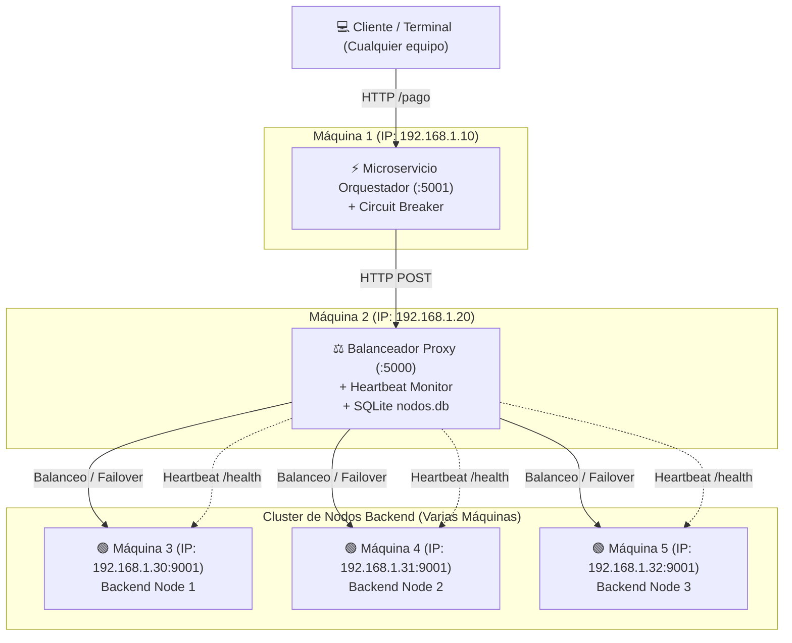

# Guía de Actividades Práctico-Experimentales (APE 15 y 16)
## Arquitectura de Microservicios Distribuidos en Python: Balanceador de Carga con Heartbeat Failover, Patrón Circuit Breaker y Persistencia en SQLite (`nodos.db`)

Este repositorio contiene la solución integral para las prácticas **APE Nro. 15 y 16** de la asignatura de **Sistemas Distribuidos**. El proyecto implementa una arquitectura distribuida tolerante a fallos en Python que combina monitorización física en segundo plano (**Heartbeat Failover**), protección lógica de red (**Patrón Circuit Breaker**) y auditoría persistente en una base de datos local **SQLite (`nodos.db`)**.

---

## 🌐 Configuración y Despliegue en un Cluster Multimáquina (Red LAN / Varias Máquinas Físicas / VMs)

Este proyecto está totalmente preparado para ser desplegado tanto en **una sola máquina (entorno local)** como en un **Cluster Multimáquina en red local (LAN)** donde cada microservicio y nodo backend se ejecuta en un equipo informático distinto.

### **Ejemplo de Topología del Cluster en Red LAN:**



### **Pasos para Ejecutar en Varias Máquinas Físicas:**

1. **En las Máquinas de Backend (IPs: 192.168.1.30, 192.168.1.31, etc.)**:
   Ejecuta el servidor backend escuchando en todas las interfaces de red:
   ```bash
   python3 backend_server.py --port 9001
   ```

2. **En la Máquina del Balanceador de Carga (IP: 192.168.1.20)**:
   Inicia el balanceador indicando la lista de IPs de los nodos del cluster en la variable `BACKEND_NODES`:
   ```bash
   BACKEND_NODES="192.168.1.30:9001,192.168.1.31:9001" python3 balanceador/app.py
   ```
   *(También puedes agregar o quitar nodos dinámicamente desde el Dashboard Web en `http://192.168.1.20:5000`)*.

3. **En la Máquina del Microservicio Orquestador (IP: 192.168.1.10)**:
   Inicia el orquestador vinculando la URL del Balanceador:
   ```bash
   BALANCER_URL="http://192.168.1.20:5000" python3 orquestador/app.py
   ```

4. **Realizar Pruebas desde Cualquier Equipo de la Red**:
   ```bash
   curl http://192.168.1.10:5001/pago
   ```

---

## 📐 Arquitectura General del Sistema

```mermaid
graph TD
    Client["📱 Cliente HTTP / cURL / Navegador"] -->|Petición /pago| Orch["⚡ Microservicio Orquestador (:5001)"]
    Orch -->|Envuelto en| CB["🛡️ Circuit Breaker (CLOSED / OPEN / HALF-OPEN)"]
    
    CB -->|Si CLOSED / HALF-OPEN| LB["⚖️ Microservicio Balanceador Proxy (:5000)"]
    CB -->|Si OPEN (< 0.01s)| FB["⚠️ Respuesta Fallback Inmediata"]
    
    LB -->|Algoritmo Least-Connections| Cluster["Cluster de Nodos Backend"]
    Cluster --> B1["🟢 Backend Node 1 (:9001)"]
    Cluster --> B2["🟢 Backend Node 2 (:9002)"]
    
    HB["❤️ Hilo Monitor Heartbeat (Intervalo 2s)"] -->|GET /health| B1
    HB -->|GET /health| B2
    HB -->|Actualiza estado_nodos| DB[("🗄️ SQLite nodos.db")]
    CB -->|Registra circuit_log| DB
```

---

## 🔄 Flujo de Funcionamiento Detallado (Paso a Paso)

### 1. Flujo Normal (Estado Operativo)
1. **Petición del Cliente**: El cliente hace una petición HTTP al Orquestador (`GET http://<IP_ORQUESTADOR>:5001/pago`).
2. **Evaluación de Circuito**: El Orquestador consulta la clase `CircuitBreaker`. Al estar en estado **`CLOSED`**, autoriza la ejecución.
3. **Reenvío al Balanceador**: El Orquestador realiza la llamada al Balanceador Proxy (`http://<IP_BALANCEADOR>:5000/balance/procesar-pago`).
4. **Balanceo de Carga**: El Balanceador consulta su lista de servidores `healthy` (actualizada continuamente por el Heartbeat) y selecciona un nodo activo del cluster.
5. **Respuesta Éxito**: El Backend procesa la petición y devuelve `200 OK`. El Orquestador resetea su contador de fallos y entrega la respuesta al cliente.

### 2. Caída de un Nodo Individual (Failover Físico - Guía 15)
1. **Caída de un Backend**: Se detiene una instancia backend en el cluster.
2. **Detección por Heartbeat**: En un intervalo de **2 segundos (timeout 1.5s)**, el hilo de trasfondo realiza `GET /health`, detecta que no responde y marca su estado como `down` en memoria e **`INACTIVO`** en SQLite (`estado_nodos`).
3. **Failover Automático**: El Balanceador retira el nodo caído de su pool activo y redirige el 100% de las peticiones a los nodos vivos del cluster.
4. **Circuito Intacto**: El Circuit Breaker del Orquestador permanece en **`CLOSED`** porque las peticiones hacia el balanceador siguen respondiendo exitosamente gracias a los nodos restantes.

### 3. Caída Masiva de Todos los Nodos (Circuit Breaker - Guía 16)
1. **Caída Total**: Caen todos los nodos del cluster simultáneamente.
2. **Acumulación de Fallos**: Las peticiones 1, 2 y 3 del Orquestador hacia el Balanceador sufren timeout o error 502/503.
3. **Apertura de Circuito (`CLOSED` -> `OPEN`)**: Al alcanzar el umbral de **3 fallos consecutivos**, el Circuit Breaker conmuta inmediatamente a estado **`OPEN`** y registra el evento en la tabla SQLite `circuit_log`.
4. **Protección y Fallback (< 0.01s)**: A partir de la petición 4, el Circuit Breaker **corta la comunicación de red sin intentar llamar al balanceador**, devolviendo de forma inmediata una respuesta alternativa (Fallback). Esto evita la saturación de sockets, hilos y latencias de timeout.
5. **Cooldown de 10s y Prueba `HALF_OPEN`**:
   - Transcurridos **10 segundos** de enfriamiento, la siguiente petición conmuta el circuito a **`HALF_OPEN`** para probar la salud de la red.
   - Si los nodos siguen caídos, la prueba falla y el circuito regresa a **`OPEN`** por otros 10 segundos.
   - Si los nodos han sido restablecidos, la prueba tiene éxito, el circuito regresa autónomamente a **`CLOSED`** y se registra el restablecimiento en `circuit_log`.

---

## 🎯 Objetivos Específicos por Guía

### Guía APE 15 (Heartbeat, Balanceador y Failover)
- **Servidores Backend Simulados**: Instancias HTTP en Python procesando peticiones en puertos/IPs independientes.
- **Balanceador de Carga (Proxy Inverso)**: Proxy en Flask con arquitectura **MVC** desacoplada.
- **Heartbeat en Tiempo Real**: Sondeo regular `< 3s` que persiste el estado físico del cluster en la tabla `estado_nodos` de `nodos.db`.
- **Failover Transparente**: Conmutación automática hacia nodos vivos sin interrupción del servicio.

### Guía APE 16 (Circuit Breaker, Microservicios y Auditoría)
- **Microservicio Orquestador**: Microservicio REST (`:5001`) independiente que actúa como API Gateway / Cliente.
- **Patrón Circuit Breaker**: Módulo `CircuitBreaker` independiente administrando los estados `CLOSED`, `OPEN` y `HALF_OPEN`.
- **Auditoría Persistente**: Registro de cambios de estado del circuito en la tabla `circuit_log` de `nodos.db`.
- **Cruce de Datos Físicos vs Lógicos**: Comprobación en SQLite de la detección física (`estado_nodos`) vs la reacción lógica de red (`circuit_log`).

---

## 📁 Estructura Explicada del Código y Módulos

```
APE_15_16_Distribuidos/
├── .gitignore                   # Reglas de exclusión de Git (venv/, nodos.db, __pycache__/)
├── requirements.txt             # Dependencias del proyecto (Flask, requests)
├── README.md                    # Documentación arquitectónica completa
├── backend_server.py            # Simulador de Servidores Backend HTTP (puertos 9001, 9002)
├── test_ape15.py                # Script de verificación automatizada para Guía 15
├── test_ape16.py                # Script de verificación automatizada para Guía 16
├── ape_guia  15 distribuidos-signed.md # Guía oficial APE 15
├── ape_guia  16 distribuidos-signed.md # Guía oficial APE 16
├── nodos.db                     # Base de datos SQLite (generada en runtime)
├── balanceador/                 # Microservicio Balanceador de Carga (Puerto 5000)
│   ├── app.py                   # Punto de entrada e hilo Heartbeat en segundo plano
│   ├── config.py                # Parámetros de timeouts e intervalos
│   ├── models/
│   │   ├── __init__.py          # Exportaciones de modelos
│   │   ├── database.py          # Administrador de SQLite (tablas estado_nodos y circuit_log)
│   │   ├── server.py            # Modelo BackendServer (Proxying y health check)
│   │   ├── balancer.py          # Lógica AILoadBalancer (Least-connections / IA Ollama)
│   │   └── metrics_history.py   # Historial en memoria para Dashboard
│   └── views/
│       ├── api.py               # Endpoints REST (/api/servers, /api/db/nodos, /api/db/circuit)
│       ├── dashboard.py         # Controlador de vista web
│       └── templates/
│           └── index.html       # Dashboard HTML/JS con monitoreo SQLite en tiempo real
└── orquestador/                 # Microservicio Orquestador (Puerto 5001)
    ├── app.py                   # Microservicio Flask protegido por Circuit Breaker
    └── circuit_breaker.py      # Implementación desacoplada del Patrón Circuit Breaker
```

---

## 🗄️ Modelo de Datos SQLite (`nodos.db`)

La base de datos SQLite `nodos.db` administra dos tablas clave:

### 1. Tabla `estado_nodos` (Heartbeat Físico - Guía 15)
```sql
CREATE TABLE IF NOT EXISTS estado_nodos (
    id INTEGER PRIMARY KEY AUTOINCREMENT,
    nodo TEXT NOT NULL UNIQUE,          -- Ejemplo: "192.168.1.30:9001"
    puerto INTEGER NOT NULL,            -- Ejemplo: 9001
    estado TEXT NOT NULL,               -- "ACTIVO" o "INACTIVO"
    latencia REAL DEFAULT 0.0,          -- Latencia en milisegundos
    ultima_actualizacion TEXT NOT NULL  -- Formato YYYY-MM-DD HH:MM:SS
);
```

### 2. Tabla `circuit_log` (Auditoría Lógica de Red - Guía 16)
```sql
CREATE TABLE IF NOT EXISTS circuit_log (
    id INTEGER PRIMARY KEY AUTOINCREMENT,
    servicio TEXT NOT NULL,             -- Ejemplo: "ServicioOrquestador"
    estado_anterior TEXT NOT NULL,      -- "CLOSED", "OPEN", "HALF_OPEN"
    nuevo_estado TEXT NOT NULL,         -- "CLOSED", "OPEN", "HALF_OPEN"
    motivo TEXT,                        -- Razón de la transición
    timestamp TEXT NOT NULL             -- Formato YYYY-MM-DD HH:MM:SS
);
```

---

## 📊 Tabla de Observaciones (Guía 16)

| Escenario | Estado de Backends | Estado BD: `estado_nodos` | Estado del Circuito (Esperado) | Tiempo de respuesta Orquestador | Registro BD: `circuit_log` |
| --- | --- | --- | --- | --- | --- |
| **Backends activos** | 9001: ACTIVO, 9002: ACTIVO | 9001: ACTIVO, 9002: ACTIVO | **`CLOSED`** | ~0.05s | `CLOSED` |
| **Caen ambos Backends (Peticiones 1-3)** | 9001: Inactivo, 9002: Inactivo | 9001: INACTIVO, 9002: INACTIVO | **`CLOSED` -> Acumula 3 fallos** | ~1s | - |
| **Backends siguen caídos (Petición 4+)** | 9001: Inactivo, 9002: Inactivo | 9001: INACTIVO, 9002: INACTIVO | **`OPEN`** | **< 0.01s** (Fallback) | `OPEN` |
| **Pasan 10s (Prueba Half-Open)** | 9001: Inactivo, 9002: Inactivo | 9001: INACTIVO, 9002: INACTIVO | **`HALF_OPEN` -> `OPEN`** | ~1s | `HALF_OPEN`, `OPEN` |
| **Backends recuperados + 10s** | 9001: ACTIVO, 9002: ACTIVO | 9001: ACTIVO, 9002: ACTIVO | **`HALF_OPEN` -> `CLOSED`** | ~0.05s | `HALF_OPEN`, `CLOSED` |

---

## ❓ Preguntas de Control Resueltas (Guía 16)

1. **En esta arquitectura integrada, si un solo backend (ej. el puerto 9001) cae pero el otro sigue activo, ¿el Circuit Breaker del Orquestador debería abrirse? Justifica tu respuesta.**
   - **Respuesta**: **No, el Circuit Breaker NO debe abrirse**. Gracias a que el Balanceador de Carga realiza failover automático a nivel de proxy, cuando el nodo 9001 cae, el balanceador detecta la falla y encamina el 100% de las solicitudes hacia el nodo vivo (puerto 9002). El Orquestador continúa recibiendo respuestas HTTP 200 exitosas del Balanceador, por lo que el Circuit Breaker se mantiene en estado **`CLOSED`**. El circuito solo se abrirá si **todos los nodos del pool caen simultáneamente** o el propio Balanceador deja de responder.

2. **¿Qué diferencia hay entre el mecanismo de Heartbeat (práctica 15) y el Circuit Breaker (práctica 16) en cuanto a la detección de fallos?**
   - **Respuesta**: 
     - **Heartbeat (Monitoreo Activo Proactivo)**: Funciona en segundo plano mediante un hilo periódico que envía pings (`GET /health`) a los nodos a intervalos regulares (sondeo constante). Su objetivo es mantener actualizado el estado físico del cluster independientemente de si hay usuarios enviando peticiones.
     - **Circuit Breaker (Monitoreo Pasivo Reactivo)**: Opera en la línea de tráfico en tiempo real sobre las solicitudes de los usuarios. Su objetivo es cortar la comunicación de red cuando detecta fallos consecutivos de negocio para evitar fallos en cascada y entregar respuestas de Fallback en `< 0.01s`.

3. **Si revisamos la base de datos SQLite justo en el momento que el circuito se abre, ¿habrá diferencia temporal (en segundos) entre el timestamp de `estado_nodos` y el de `circuit_log`? ¿Por qué?**
   - **Respuesta**: **Sí, habrá una pequeña diferencia temporal**. `circuit_log` registra la transición al instante exacto en que la petición del usuario alcanza el umbral de fallos (tiempo real de tráfico). En cambio, `estado_nodos` actualiza su timestamp cuando el hilo de Heartbeat ejecuta su siguiente ciclo de sondeo (cada 2s).

4. **¿En qué escenario de la vida real (ej. Netflix) es crítico tener un Fallback (respuesta alternativa) en lugar de solo devolver un error 500 al usuario cuando el Circuit Breaker se abre?**
   - **Respuesta**: En la pantalla de inicio de Netflix. Si el microservicio distribuido de recomendaciones personalizadas o historial de visualización se cae o sufre timeouts, en lugar de mostrar un error HTTP 500 al usuario, el Circuit Breaker se abre y devuelve un **Fallback** con una lista estática de películas populares o tendencias globales. El usuario puede seguir navegando y reproduciendo contenido sin notar la falla del microservicio de recomendaciones.

5. **Si el balanceador de carga muere repentinamente (se cae el proceso del puerto 5000), ¿cómo reaccionará el Circuit Breaker del Orquestador? ¿Podrá el sistema recuperarse automáticamente alguna vez?**
   - **Respuesta**: El Orquestador acumulará 3 fallos de conexión hacia el puerto 5000 y el Circuit Breaker pasará de inmediato a **`OPEN`**, entregando respuestas de Fallback en `< 0.01s`. **Sí se recuperará automáticamente**: una vez que el proceso del balanceador vuelva a iniciarse, al transcurrir el tiempo de enfriamiento (10s), el Circuit Breaker pasará a **`HALF_OPEN`**, enviará una petición de prueba que resultará exitosa y retornará autónomamente a estado **`CLOSED`**.
